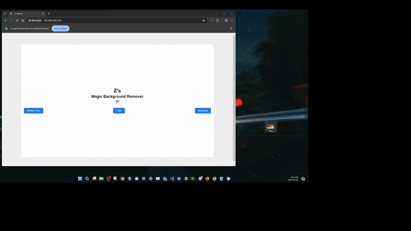
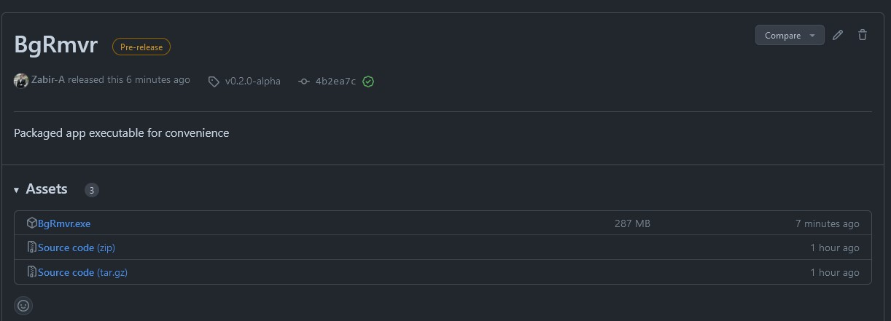
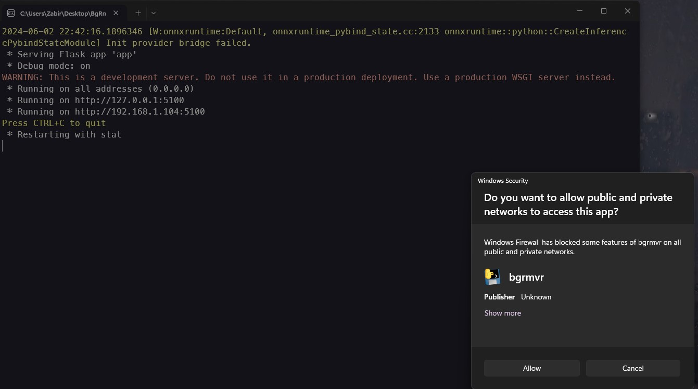
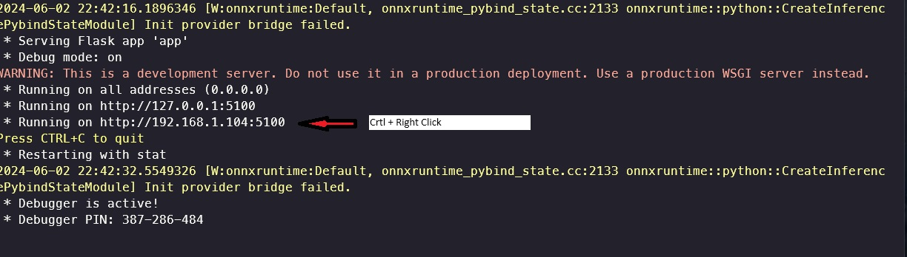
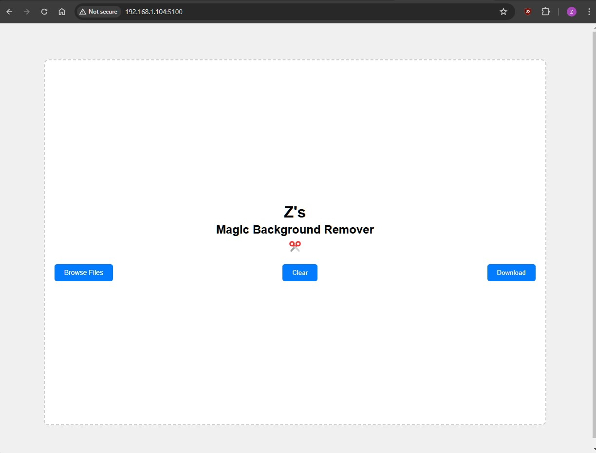

This is a simple Flask web application that utilizes [Rembg](https://github.com/danielgatis/rembg) to remove the background of an image.

It is based on the project found at [codediodeio/rembg-webapp-tutorial](https://github.com/codediodeio/rembg-webapp-tutorial ) with some modifications and minor changes.

## Application Demo
Simply drag and drop an image or browse from files, wait for the application to process and it will download. 

### Original Image 🐕




### Downloaded Image 🐶


## Running the application locally

1. Download / clone the project
```
git clone https://github.com/Zabir-A/Background-Remover-V2/
```
2. Download u2net.onnx into the root project directory
```
wget https://github.com/danielgatis/rembg/releases/download/v0.0.0/u2net.onnx
```
3. Install Python dependencies 🐍
```
pip install -r requirements.txt
```
4. Run Python script 🐍
```
python app.py
```

## Running the application in a Docker Container 🐋

1. Build the image:
```
docker build -t <your-image-name>:<tag> .
```

2. Run the Docker container:
```
docker run -d -p <host-port>:<container-port> --name <your-container-name> <your-image-name>:<tag>
```

## Running on ARM Platforms 🍓🥧
### If you want to run the application on ARM architecture, such as a Raspberry Pi, change the Dockerfile content as shown below:
```
FROM python:3.8-slim

COPY u2net.onnx /home/.u2net/u2net.onnx

WORKDIR /app

COPY requirements.txt .

RUN apt-get update && apt-get install -y libpq-dev build-essential

RUN apt-get install cmake -y

RUN pip install --no-cache-dir -r requirements.txt

COPY . .

EXPOSE 5100

CMD ["python", "app.py"]
```
1. Build the image for ARM architecture
```
docker build --tag <your-image-name>:<tag> --platform linux/arm64 .
```
2. Run the Docker container
```
docker run -d -p <host-port>:<container-port> --name <your-arm-container-name> <your-arm-image-name>
```
# Windows Installation & Usage (Lazy Way - Not Recommended)

I have included a packaged executable version of the application for those that don't want to go through all that, and just want to test it.

Obviously, this is not how the Web Application should be installed or run, but it works. It will run Flask in a development server, so use it at your risk. 

## Downloading the packaged application (BgRmvr.exe):

1. Download the executable from: https://github.com/Zabir-A/Background-Remover-V2/releases/download/v0.2.0-alpha/BgRmvr.exe




2. Run the BgRmvr.exe. It will open up your terminal. Wait a few seconds, a prompt may pop up. Click allow. 



3. Ctrl + Right Click the address
   


4. Clicking the link will open up the application in your default browser.


