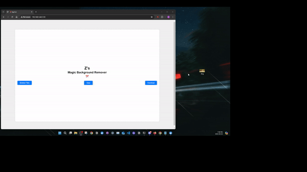

This is a web application that utilizes [Rembg](https://github.com/danielgatis/rembg) to remove the background of an image using "AI" magic sorcery (not).

It's based on the project found at [codediodeio/rembg-webapp-tutorial](https://github.com/codediodeio/rembg-webapp-tutorial) with some modifications and minor changes.

## Application Demo
Simply drag and drop an image, or browse from files. Wait for the application to process and it will download automatically. 

### Original Image 🐕


### Downloaded Image 🐶



## Running the application locally

1. Download / clone the project
```
git clone https://github.com/Zabir-A/Background-Remover-V2/
```
2. Download u2net.onnx into the root project directory
```
wget https://github.com/danielgatis/rembg/releases/download/v0.0.0/u2net.onnx
```
3. Install Python dependencies 🐍
```
pip install -r requirements.txt
```
4. Run Python script 🐍
```
python app.py
```

## Running the application in a Docker Container 🐋

1. Build the image:
```
docker build -t <your-image-name>:<tag> .
```

2. Run the Docker container:
```
docker run -d -p <host-port>:<container-port> --name <your-container-name> <your-image-name>:<tag>
```

## Running on ARM Platforms 🍓🥧
#### If you want to run the containerized application on a Raspberry Pi (4+). 

#### Change the default Dockerfile content as shown below:
```
FROM python:3.8-slim

COPY u2net.onnx /home/.u2net/u2net.onnx

WORKDIR /app

COPY requirements.txt .

RUN apt-get update && apt-get install -y libpq-dev build-essential

RUN apt-get install cmake -y

RUN pip install --no-cache-dir -r requirements.txt

COPY . .

EXPOSE 5100

CMD ["python", "app.py"]
```
1. Build the image for ARM Platforms
```
docker build --tag <your-image-name>:<tag> --platform linux/arm64 .
```
2. Run the Docker container
```
docker run -d -p <host-port>:<container-port> --name <your-arm-container-name> <your-arm-image-name>
```
# Windows Installation & Usage

## (Not Recommended)

For those that don't want to go through all that, and just want to test it (for fun). There's a packaged executable version of the application.

Obviously, this is not how any Web Application (in development) should be used, but, "it just works". 

So, use it at your own risk. 

## Downloading the packaged application (BgRmvr.exe):

1. Download the executable from: https://github.com/Zabir-A/Background-Remover-V2/releases/download/v0.2.0-alpha/BgRmvr.exe


2. Run BgRmvr.exe. It will open up CMD, PowerShell or whatever terminal you have. Wait a few seconds, a window prompt may pop up. Click allow. If you don't, it will not work.


3. Ctrl + Right Click one of the addresses.
   


4. Clicking the link (address) will open up the application in your default browser.


5. If you made it this far, congrats! Here's a 🍪
